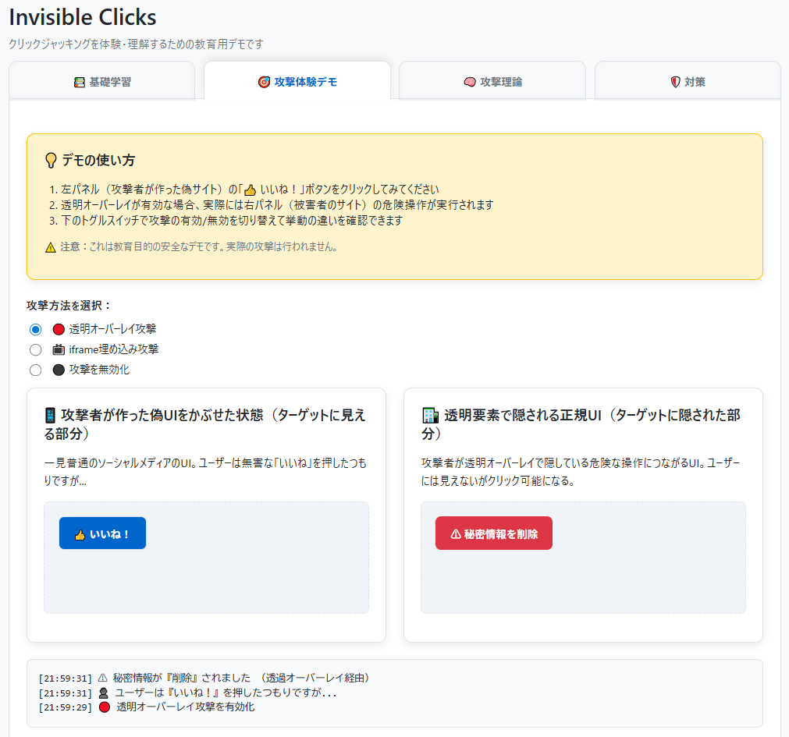

<!--
---
title: Invisible Clicks
category: web-security
difficulty: 1
description: Experience clickjacking safely in the browser and learn common defenses.
tags: [clickjacking, web-security, education, typescript]
demo: https://ipusiron.github.io/invisible-clicks/
---
-->

# Invisible Clicks - クリックジャッキング攻撃体験ツール


[](https://ipusiron.github.io/invisible-clicks/)

**Invisible Clicks**は、ブラウザーだけで**クリックジャッキング**を安全に体験できる教育用デモツールです。

透明オーバーレイやiframeの上乗せを模擬し、意図しない危険操作が発火する仕組みと対策を学べます。

---

## 🌐 デモページ

👉 **[https://ipusiron.github.io/invisible-clicks/](https://ipusiron.github.io/invisible-clicks/)**

ブラウザーで直接お試しいただけます。

---

## 📸 スクリーンショット

>
>
>*透明オーバーレイ攻撃の体験デモ*

---

## 🧪 機能・使い方

### 4つのタブ構成

- **📚 基礎学習**: クリックジャッキングの概念と攻撃手法の解説
- **🎯 攻撃体験デモ**: 実際にクリックジャッキングを安全に体験
- **🧠 攻撃理論**: 技術的メカニズムの詳細解説（アコーディオン形式）
- **🛡️ 対策**: 防御手法と実装チェックリスト（アコーディオン形式）

### 攻撃体験デモの使い方

1. **攻撃方法を選択**:
   - 🔴 透明オーバーレイ攻撃
   - 📺 iframe埋め込み攻撃  
   - ⚫ 攻撃を無効化（正規UIのみ表示）

2. **体験手順**:
   - 攻撃有効時: 左パネル（偽サイト）の「👍 いいね！」をクリック
   - 実際には右パネル（正規サイト）の「⚠ 秘密情報を削除」が実行される
   - 攻撃無効時: 左パネルが非表示になり、正規UIを直接操作可能

3. **ログ表示**: すべての操作がリアルタイムでログに記録され、攻撃の流れを理解できる

## 📖 技術解説

クリックジャッキング攻撃の詳細な技術解説、具体的な攻撃手法、対策方法については、専用ガイドをご覧ください：

👉 **[CLICKJACKING-GUIDE.md](CLICKJACKING-GUIDE.md)** - クリックジャッキング攻撃 技術解説ガイド

### 主な内容
- 攻撃手法の詳細（古典的クリックジャッキング、ライクジャッキング、カーソルジャッキング）
- 防御策の実装方法（HTTPヘッダー、JavaScript、UI/UX対策）
- 実装チェックリスト
- 攻撃の検出方法

## 🛠 開発

### 技術スタック
- **TypeScript**: 型安全なJavaScript開発
- **Vite**: 高速なビルドツール
- **HTML5**: `<details>`要素を活用したアコーディオンUI
- **CSS3**: グリッドレイアウト、フレックスボックス、カスタムプロパティ
- **GitHub Pages**: 静的サイトホスティング

### セットアップ

```bash
npm install
npm run dev
npm run build
```

ビルド成果物は"/docs"フォルダーに出力され、GitHub Pages（mainブランチ、"docs"フォルダー）で公開しています。

### 開発メモ

開発中に発見した技術的な課題と解決策については、[DEVELOPMENT.md](DEVELOPMENT.md)にまとめています。

---

## 📂 ディレクトリー構成

```
invisible-clicks/
├── src/
│   └── main.ts              # TypeScriptメインロジック（タブ制御、攻撃シミュレーション）
├── docs/                    # GitHub Pages公開用ビルド成果物
│   ├── .nojekyll
│   ├── index.html
│   └── assets/
│       ├── index-*.js       # バンドルされたJavaScript
│       └── index-*.css      # バンドルされたCSS
├── assets/
│   └── screenshot.png       # プロジェクトのスクリーンショット
├── index.html               # メインHTMLファイル
├── style.css                # CSSスタイルシート
├── vite.config.ts           # Viteビルド設定
├── tsconfig.json            # TypeScript設定
├── package.json             # 依存関係とスクリプト
├── CLAUDE.md                # Claude Code用プロジェクト指示
├── DEVELOPMENT.md           # 開発メモと技術的発見
├── CLICKJACKING-GUIDE.md    # クリックジャッキング技術解説ガイド
└── README.md                # このファイル
```

---

## 📄 ライセンス

MIT License – 詳細は [LICENSE](LICENSE) を参照してください。

---

## 🛠 このツールについて
本ツールは、「生成AIで作るセキュリティツール100」プロジェクトの一環として開発されました。
このプロジェクトでは、AIの支援を活用しながら、セキュリティに関連するさまざまなツールを100日間にわたり制作・公開していく取り組みを行っています。

プロジェクトの詳細や他のツールについては、以下のページをご覧ください。

🔗 [https://akademeia.info/?page_id=42163](https://akademeia.info/?page_id=42163)