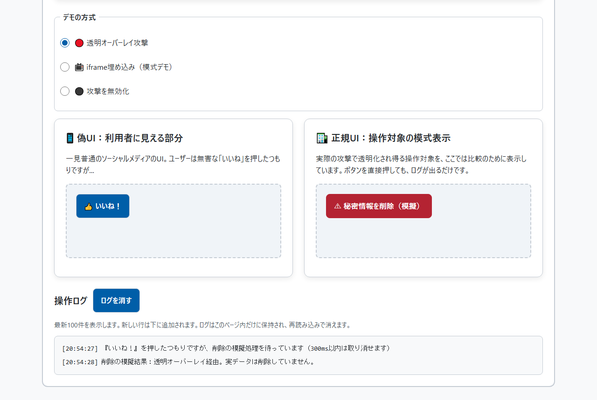

<!--
---
id: day058
slug: invisible-clicks

title: "Invisible Clicks"

subtitle_ja: "クリックジャッキング攻撃体験ツール"
subtitle_en: "Clickjacking Attack Experience Tool"

description_ja: "ブラウザーでクリックジャッキングの仕組みを学ぶ教育用デモツール。透明なクリック対象の重なりとiframe方式の模式図を使い、見える操作とクリック先の違い、防御策の役割と限界を学べます。実データの削除や外部iframeの読み込みは行いません。"
description_en: "An educational browser demo of clickjacking. Explore the difference between visible controls and click targets through a transparent overlay and a same-document illustration of iframe-based attacks. Learn the roles and limits of defenses without deleting real data or loading external iframes."

category_ja:
  - Webセキュリティ
category_en:
  - Web Security

difficulty: 3

tags:
  - clickjacking
  - web-security
  - education
  - typescript
  - vite

repo_url: "https://github.com/ipusiron/invisible-clicks"
demo_url: "https://ipusiron.github.io/invisible-clicks/"

hub: true
---
-->

[English](README.en.md) · 日本語

# Invisible Clicks - クリックジャッキング攻撃体験ツール


[](https://ipusiron.github.io/invisible-clicks/)

**Day058 - 生成AIで作るセキュリティツール100**

Invisible Clicksは、ブラウザーでクリックジャッキングの仕組みを学ぶ教育用デモツールです。
透明なクリック対象の重なりとiframe方式の模式図で、見える操作とクリック先の違いを確かめられます。
操作結果はログ表示だけで、実データの削除や外部iframeの読み込みは行いません。

画面とスクリーンショットは現在日本語です。英語の説明はREADME.en.mdに用意しています。

---

## 🌐 デモページ

👉 **[https://ipusiron.github.io/invisible-clicks/](https://ipusiron.github.io/invisible-clicks/)**

ブラウザーで直接お試しいただけます。

---

## 📸 スクリーンショット

>
>
>*透明オーバーレイ攻撃の体験デモ*

---

## ✨ 機能と使い方

### 4つのタブ構成

- 📚 基礎学習：クリックジャッキングの概念と攻撃手法の解説
- 🎯 攻撃体験デモ：同じページ内の要素を使ったクリック先の観察
- 🧠 攻撃理論：攻撃が成立する条件とコード例の解説（アコーディオン形式）
- 🛡️ 対策：防御手法の役割、限界、実装チェックリスト（アコーディオン形式）

### 攻撃体験デモの使い方

1. 「攻撃体験デモ」タブを開き、モードを選択
   - 透明オーバーレイ攻撃：見える「👍 いいね！」の上に透明なクリック対象を配置
   - iframe埋め込み（模式デモ）：iframe内の操作に見立てた同一ページ内の図を表示
   - 攻撃を無効化：偽サイトのパネルを隠し、正規UIの図だけを表示
2. 偽サイトの「👍 いいね！」をマウスまたはタッチで押し、ログに表示される模擬操作を確認
3. 正規UIの削除ボタンを直接押した場合と比較。どのモードでも実データの削除はなし
4. 「ログを消す」で表示を消し、別のモードで再試行

ログは最新100件を上から古い順に表示し、新しい行を下へ追加します。
ページを閉じるとログは失われます。
攻撃による模擬結果を300ms後に表示するのは、操作の順序を観察するための演出です。
モード変更、タブ移動、ログ消去で保留中の表示を取り消します。
実際のサイトで成立した操作まで取り消せるという意味ではありません。

### キーボード操作

タブは左右矢印キーとHome／Endで切り替えられます。
Tabキーでボタンへ移動し、EnterまたはSpaceで操作できます。
透明オーバーレイはマウスとタッチのクリックを受けるため、キーボードで「👍 いいね！」を押した場合は通常の「いいね」として記録されます。
この違いはデモの入力方式の違いを示すもので、キーボードならあらゆるクリックジャッキングを防げるという説明ではありません。

## ⚠️ デモの範囲と限界

iframe方式の表示は、通常の`div`を使った模式デモです。
本物のiframe、別オリジンのページ、ログイン状態、HTTPレスポンスヘッダーによる埋め込み制限は再現していません。
このデモを操作しても、他のサイトの脆弱性や防御設定は判定できません。

デモ操作に伴う外部への送信、外部iframeの読み込み、カメラやマイクの利用許可要求は行いません。
ログはページ内のメモリーにだけ保持し、ブラウザーへの永続保存もしません。
参考資料のリンクを開いた場合は、リンク先のサイトへ移動します。

画面のmeta CSPは読込元などを制限するもので、他サイトからの埋め込みを禁止するものではありません。
`frame-ancestors`とX-Frame-Optionsによる埋め込み制限には、HTTPレスポンスヘッダーの設定が必要です。
それらをmetaに書いても防御にはなりません。

## 📖 技術解説

クリックジャッキングの成立条件と対策方法は、専用ガイドをご覧ください。

👉 [クリックジャッキングの技術解説ガイド](CLICKJACKING-GUIDE.md)

### 主な内容

- 攻撃手法の詳細（古典的クリックジャッキング、ライクジャッキング、カーソルジャッキング）
- HTTPレスポンスヘッダーによる埋め込み制限と、CSRF対策などとの役割の違い
- SameSite、フレーム脱出コード、確認ダイアログの限界
- 実装チェックリストと開発者ツールによる観察方法

実際のiframeを使った演習には、[PortSwigger Web Security Academyのクリックジャッキング教材](https://portswigger.net/web-security/learning-paths/clickjacking)を参照してください。

## 🎯 ユースケース

このツールならではの使い方

- ボタンが押せない不具合の原因を学ぶ（Web制作のデバッグ）：透明オーバーレイのモードでは、見えている「👍 いいね！」ではなく、その上に重ねた透明な要素がクリックを受ける。Webページで「ボタンを押しても反応しない」ときによくある、透明な要素や余白の広い要素がボタンの上に重なっている状態と同じしくみで、ブラウザーの開発者ツールで要素を選べば、上に重なった要素がわかることを確かめられる。
- 押し方の違いをブラウザーがどう見分けるかを知る（Web制作・アクセシビリティ）：同じ「👍 いいね！」でも、マウスやタッチで押すと透明な要素が受け取り、キーボード（TabキーとEnter）で押すと通常の「いいね」として記録される。本ツールは、clickイベントのdetailが1以上か、入力の種別がmouse・touch・penならポインターの操作、それ以外をキーボードの操作として扱う（タッチではdetailが0のclickも届くため、入力の種別も見る）。
- 遅れて届く結果を捨てる設計を見る（プログラミングの授業・非同期処理）：模擬結果は300ms後に表示されるが、その前にモードを変える・タブを移る・ログを消すと、予約していた結果は表示されない。予約のたびに世代番号を控え、表示の直前に番号が変わっていれば捨てる作りで、検索の候補表示などで古い結果が新しい結果を上書きする不具合を防ぐ考え方と同じである。

一般的な使い方

- 授業や自習：見えるボタンとクリックを受ける要素を比較し、透明でも操作対象になる仕組みを観察する。
- UI設計や社内研修：マウス、タッチ、キーボードの違いを説明する。実際のサービスの脆弱性を判定する教材ではない。
- 家庭でのネット利用の学習：内蔵の模擬画面を使い、見かけの操作と結果が異なる場合を一緒に確認する。
- 技術記事の理解：CSRF、埋め込み制限、認証の役割をガイドと一次資料で整理し、必要に応じて外部の演習教材へ進む。

## 🛠 開発

### 技術スタック

- TypeScript：UIとデモ状態の管理
- Vite：開発用HTTPサーバーと公開用ビルド
- HTML：`<details>`要素によるアコーディオンUI
- CSS：グリッドレイアウト、フレックスボックス、カスタムプロパティ
- Node.js標準のテストランナー：回帰テスト
- GitHub Pages：静的サイトホスティング

### セットアップ

Node.js 22.18以上を使用します。
依存関係が未導入の環境では、パッケージを確認したうえでインストールしてください。

```bash
npm install
npm run dev
```

表示されたローカルHTTPのURLをブラウザーで開きます。
開発時もCSPによる通信制限を維持するため、自動更新は無効にしています。
編集後はブラウザーを手動で再読み込みしてください。
ルートの`index.html`もビルド済みの`docs/index.html`も、`file://`で直接開く利用方法には対応していません。

### 検証とビルド

```bash
npm test
npm run typecheck
npm run build
npm run preview
```

`npm test`はNode.js組み込み機能による回帰テストで、開発依存パッケージのインストールは不要です。
`npm run typecheck`はTypeScriptの型検査を行います。
`npm run build`も型検査を行ってから、公開用のファイルを`docs/`へ生成します。
生成物の確認には、プレビュー用HTTPサーバーの`http://localhost:4173/invisible-clicks/`を使用します。
公開先はGitHub Pagesのmainブランチにある`docs/`です。

自動テストと実ブラウザーでの確認は別です。
クリック領域、キーボード操作、画面幅ごとの表示、コンソールのエラーは、[開発手順](DEVELOPMENT.md)に沿ってブラウザーでも確認します。

### 開発メモ

実装上の制約と検証項目は、[DEVELOPMENT.md](DEVELOPMENT.md)にまとめています。

---

## 🧪 テスト

Node.js 22.18以上で`npm test`を実行します。
テストはNode.js標準機能だけを使い、依存パッケージのインストールは不要です。
状態と取消処理、UIイベント、教材HTML、文書、配色、書式を検査します。
GitHub Actionsにも、pushとpull_requestで同じテストを実行する設定を用意しています。
実際のブラウザーによる描画とタップの確認は、これらの自動テストとは別に行います。

## 📁 ディレクトリー構造

```
invisible-clicks/                 # プロジェクトルート
├── .gitignore                   # 生成物とローカル設定の除外
├── .github/                     # GitHub用の設定
│   └── workflows/               # 自動検証の定義
│       └── test.yml             # Node.jsでの回帰テスト
├── src/                         # TypeScriptのソース
│   ├── main.ts                  # タブ、操作、ログの表示制御
│   └── demo-state.ts            # モードと保留中の模擬操作の管理
├── test/                        # Node.js標準の回帰テスト
│   ├── support/                 # テストの補助処理
│   │   └── dom.js               # DOMスタブとUIテストの実行補助
│   ├── state.test.js            # モード変更と保留処理の取消
│   ├── html.test.js             # 教材HTMLとCSPの構造
│   ├── readme.test.js           # 文書と実装の整合性
│   ├── readme-en.test.js        # 日英READMEの整合性
│   ├── contrast.test.js         # 文字色と背景色の組み合わせ
│   ├── format.test.js           # ファイルの書式
│   └── ui.test.js               # UI操作と表示状態
├── docs/                        # GitHub Pages公開用のビルド成果物
│   ├── .nojekyll                # Jekyll処理の無効化
│   ├── index.html               # 公開用HTML
│   └── assets/                  # ビルドで生成する静的ファイル
│       ├── index-*.js           # バンドル済みJavaScript
│       └── index-*.css          # バンドル済みCSS
├── public/                      # ビルド時にそのままコピーするファイル
│   └── .nojekyll                # 公開先に配置するJekyll無効化ファイル
├── assets/                      # README用の画像
│   └── screenshot.png          # 透明オーバーレイのデモ画面
├── index.html                   # 画面と説明用のコード例
├── style.css                    # レイアウトと配色
├── vite.config.ts               # ベースパスとビルドの設定
├── tsconfig.json                # TypeScriptの設定
├── package.json                 # 依存関係と実行スクリプト
├── package-lock.json            # npm依存関係の固定情報
├── CLAUDE.md                    # 開発エージェント向けの作業条件
├── DEVELOPMENT.md               # 保守条件と検証手順
├── CLICKJACKING-GUIDE.md         # 攻撃の仕組みと防御策の解説
├── LICENSE                      # MITライセンス
├── README.md                    # 日本語の説明
└── README.en.md                 # 英語の説明
```

---

## 💻 動作環境

- 表示と操作：JavaScriptとES Modulesを利用できるブラウザー、HTTPまたはHTTPS経由での起動
- ローカルのテスト：Node.js 22.18以上
- 開発とビルド：ロックファイルに記録されたTypeScriptとVite

`file://`での直接起動には対応していません。

## 📄 ライセンス

MIT License。詳細は[LICENSE](LICENSE)を参照してください。

---

## 🛠 このツールについて

本ツールは、「生成AIで作るセキュリティツール100」プロジェクトの一環として開発されました。
このプロジェクトでは、AIの支援を活用しながら、セキュリティに関連するさまざまなツールを100日間にわたり制作・公開していく取り組みを行っています。

プロジェクトの詳細や他のツールについては、以下のページをご覧ください。

🔗 [https://akademeia.info/?page_id=42163](https://akademeia.info/?page_id=42163)
